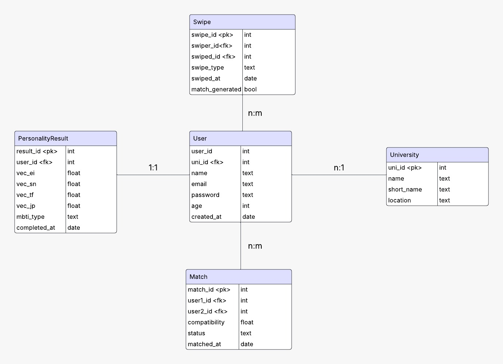

# Datenmodell

## User
Speichert die Informationen über alle User.  
Jeder User ist mit genau **einer Universität (`uni_id`)** verbunden.

**Wichtige Felder:**
- `user_id` – Primärschlüssel  
- `uni_id` – Fremdschlüssel zur `University`  
- `name`, `email`, `password`, `age`  
- `created_at` – Registrierungszeitpunkt  

---

## University
Beinhaltet alle Berliner Hochschulen, aus denen User wählen können.

**Wichtige Felder:**
- `uni_id` – Primärschlüssel  
- `name` – Vollständiger Name der Hochschule  
- `short_name` – z. B. `"FU"`  
- `location` – Stadtteil oder Adresse  

---

## PersonalityResult
Speichert die Ergebnisse des Persönlichkeitstests als numerischen Vektor und MBTI-Typ.  
Ein User kann mehrere Testergebnisse haben.

**Wichtige Felder:**
- `result_id` – Primärschlüssel  
- `user_id` – Fremdschlüssel zum `User`  
- `vec_ei`, `vec_sn`, `vec_tf`, `vec_jp` – Vektorwerte  
- `mbti_type` – berechneter Typ (z. B. `"INTP"`)  
- `completed_at` – Testzeitpunkt  

---

## Swipe
Jeder Swipe wird hier gespeichert, unabhängig davon, ob es zu einem Match kommt.  
So kann die App z. B. vermeiden, dass jemand mehrfach angezeigt wird.

**Wichtige Felder:**
- `swipe_id` – Primärschlüssel  
- `swiper_id` / `swiped_id` – Wer hat wen geswiped?  
- `swipe_type` – `"like"` oder `"dislike"`  
- `swiped_at` – Zeitstempel  
- `match_generated` – `True`, wenn daraus ein Match wurde  

---

## Match
Speichert bestätigte Matches zwischen zwei Usern (wenn beide „like“ geswiped haben).

**Wichtige Felder:**
- `match_id` – Primärschlüssel  
- `user1_id` / `user2_id` – Beteiligte User  
- `compatibility` – Score von `0.0` bis `1.0`  
- `status` – z. B. `"active"`, `"expired"`  
- `matched_at` – Zeitpunkt des Matches  

