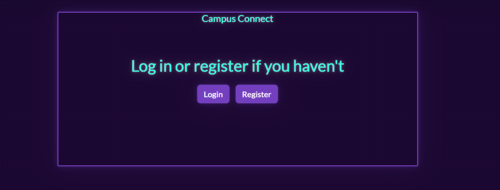
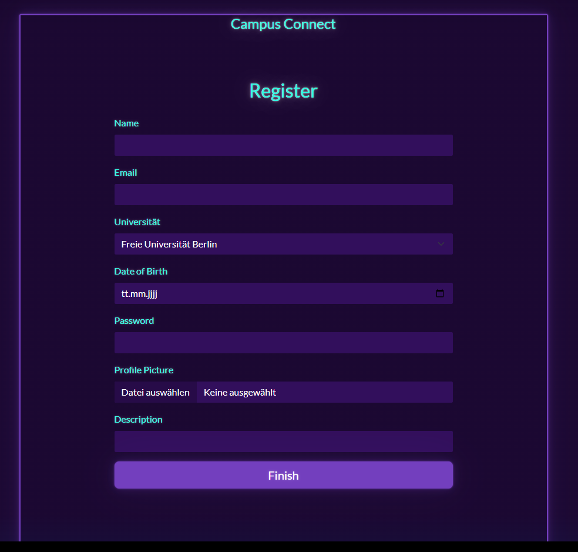
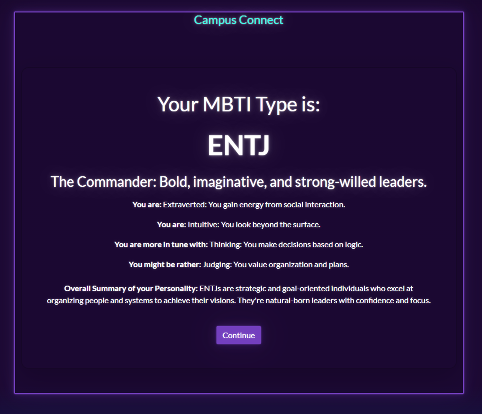
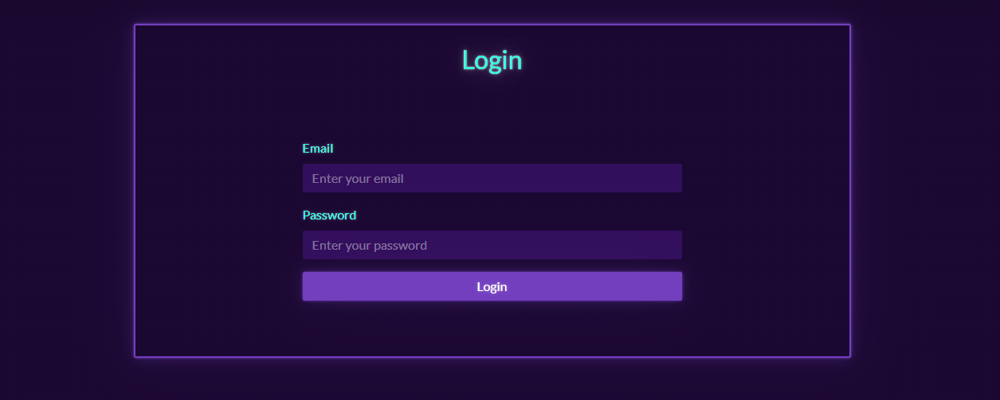
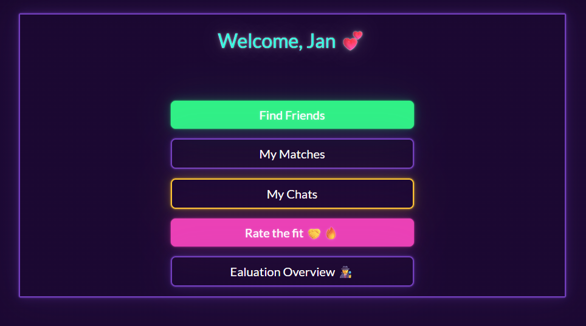
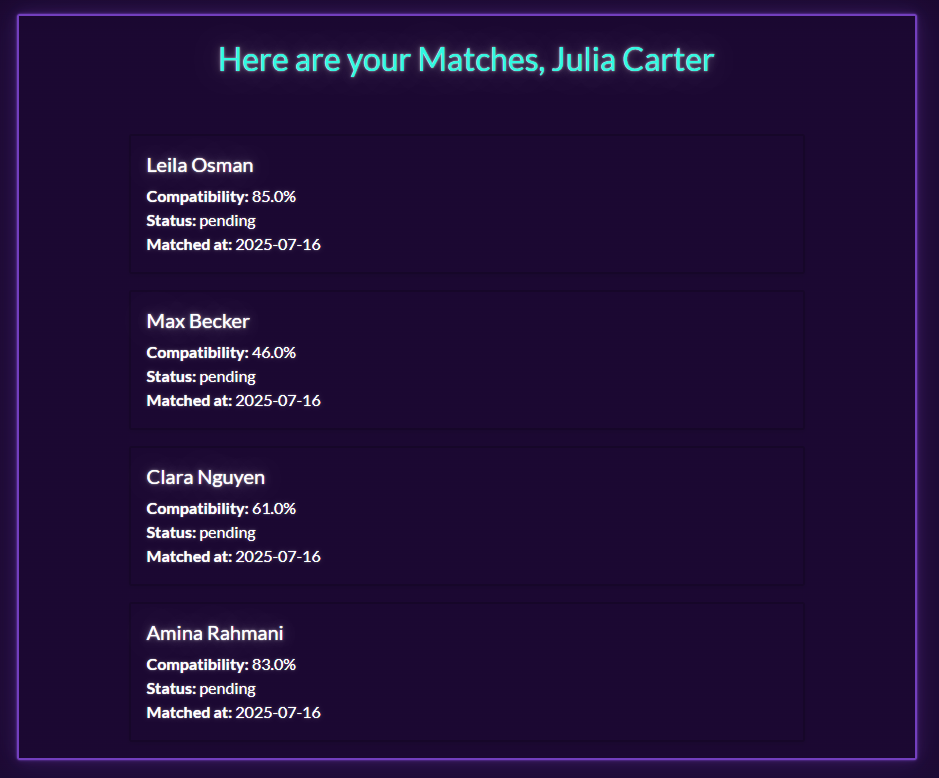
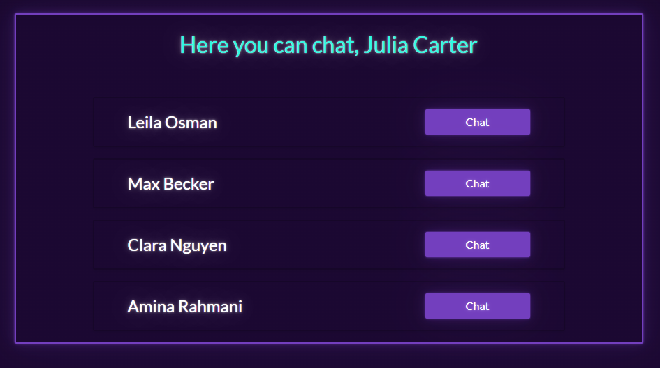
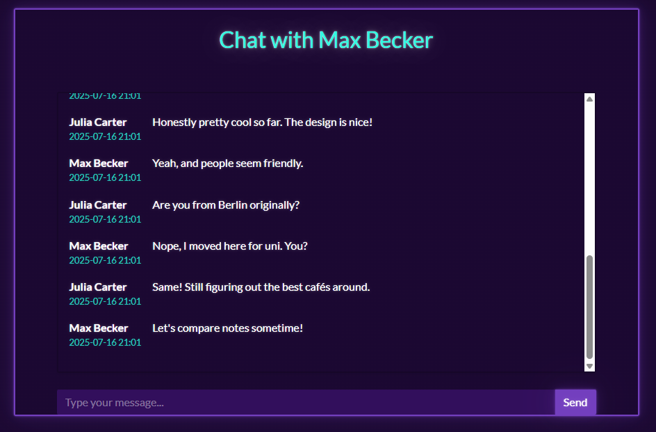
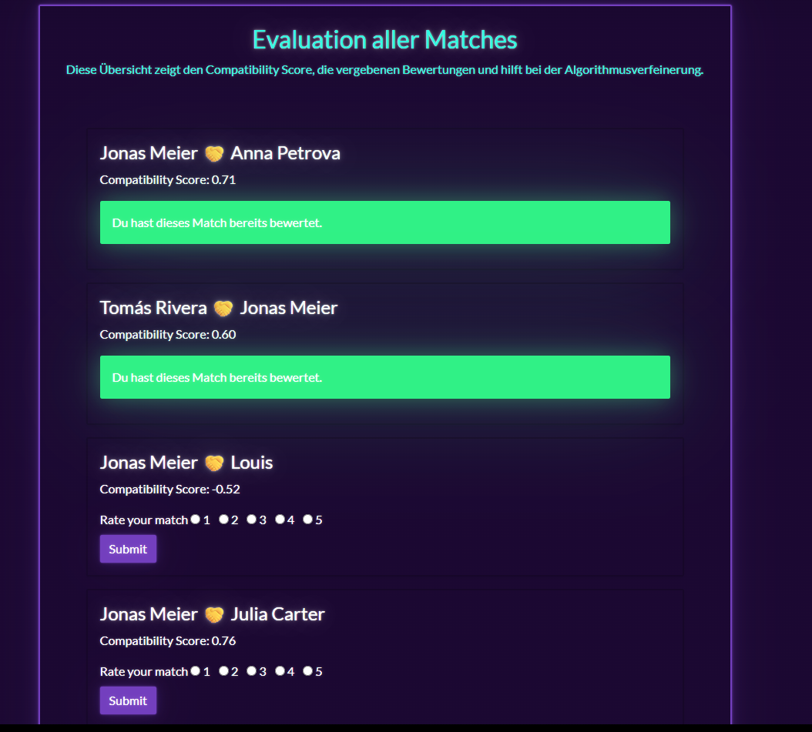
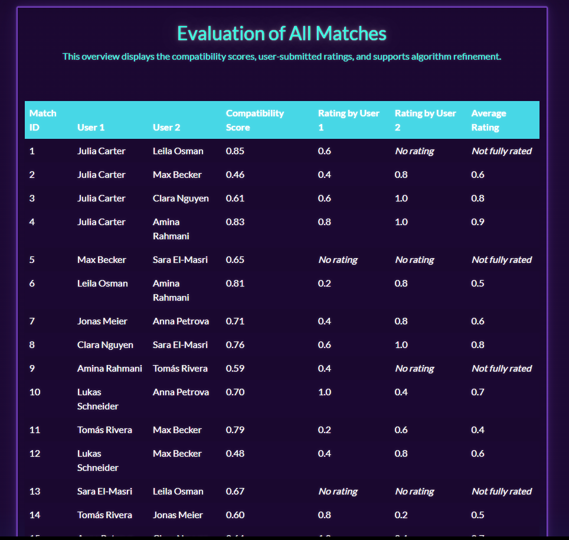

[Jan Busson]
{: .label }

# API-Referenz
{: .no_toc }

  

    Inhaltsverzeichnis
  

  {: .text-delta }
- TOC
{:toc}

<!-- trigger build -->

## Start

### `index()`

**Route:** `/`

**Methods:** `GET`, `POST`

**Zweck:**  
Zeigt die Startseite der Anwendung an.  
Stellt zwei Buttons bereit – *Login* und *Register* – über das `CreateStartForm`.  
Je nach Auswahl des Nutzers erfolgt eine Weiterleitung zur Login- oder Registrierungsseite.

**Beispielhafte Ausgabe:**  

---

## Registrierung

### `register()`

**Route:** `/register`

**Methods:** `GET`, `POST`

**Zweck:**  
Zeigt das Registrierungsformular über `CreateRegisternForm` an.  
Der Nutzer gibt Name, E-Mail, Geburtsdatum, Universität (Dropdown), Passwort, Beschreibung sowie ein Profilbild an.  
Bei gültiger Eingabe wird ein neuer Nutzer erstellt und in der Datenbank gespeichert.  
Nach erfolgreicher Registrierung erfolgt eine Weiterleitung zum Persönlichkeitstest.

**Beispielhafte Ausgabe:**  

---

## Persönlichkeitstest

### `quiz()`

**Route:** `/quiz`

**Methods:** `GET`

**Zweck:**  
Zeigt den interaktiven Persönlichkeitstest an.  
Der Nutzer beantwortet 20 Fragen zu 4 Persönlichkeitsdimensionen (z. B. Extraversion vs. Introversion, Sensing vs. Intuition).  
Jede Frage wird auf einer Skala von +3 bis –3 über gestylte Radio-Buttons beantwortet.  
Die Antworten werden per POST an `/quiz_results` gesendet.

**Beispielhafte Ausgabe:**  

---

### `results()`

**Route:** `/quiz_results`

**Methods:** `POST`

**Zweck:**  
Verarbeitet die übermittelten Antworten des Persönlichkeitstests.  
Berechnet den MBTI-Typ des Nutzers durch Aufsummieren der Antworten in vier Dimensionen:
- Extraversion/Introversion (E/I)  
- Sensing/Intuition (S/N)  
- Thinking/Feeling (T/F)  
- Judging/Perceiving (J/P)

Der finale Typ (z. B. `INTJ`) wird genutzt, um:
- Eine Zusammenfassung und Beschreibung aus dem vordefinierten `information`-Dictionary zu laden  
- Das Ergebnis in der Tabelle `PersonalityResult` der Datenbank zu speichern  
- Die Seite `quiz_results.html` mit den Informationen zum Persönlichkeitstyp zu rendern

**Beispielhafte Ausgabe:**  

---

## Login

### `login()`

**Route:** `/login`

**Methods:** `GET`, `POST`

**Zweck:**  
Zeigt das Login-Formular mittels `CreateLoginForm` an.  
Nach dem Absenden überprüft die Funktion E-Mail und Passwort über `check_user_credentials()` aus dem DAO.  
- Bei gültigen Anmeldedaten wird der Nutzer in der Session gespeichert und zu `/welcome` weitergeleitet.  
- Bei ungültigen Anmeldedaten wird eine Fehlermeldung angezeigt und die Seite neu geladen.

**Beispielhafte Ausgabe:**  

---

## Willkommen

### `welcome()`

**Route:** `/welcome`

**Methods:** `GET`, `POST`

**Zweck:**  
Zeigt das Willkommens-Dashboard nach erfolgreichem Login.  
Der aktuelle Nutzer wird über die Session geladen, anschließend stehen mehrere interaktive Optionen im `CreateWelcomeForm` zur Verfügung:
- **Find Friends** → Weiterleitung zu `/matching/<user_id>`
- **My Matches** → Weiterleitung zu `/my_matches`
- **My Chats** → Weiterleitung zu `/chat`
- **Rate the fit 🤝🔥** → Weiterleitung zu `/evaluate_match`
- **Evaluation Overview 🕵** → Weiterleitung zu `/evaluation_overview`

Wenn kein Nutzer in der Session vorhanden ist, wird ein 404-Fehler ausgelöst.

**Beispielhafte Ausgabe:**  

---

## Matching

### `matching()`

**Route:** `/matching`

**Methods:** `GET`, `POST`

**Zweck:**  
Zeigt dem aktuellen Nutzer ein zufällig ausgewähltes Nutzerprofil, das noch nicht geswipet wurde.  
Über das Formular `CreateMatchingForm` kann der Nutzer zwischen folgenden Optionen wählen:
- **Like**: Erstellt einen „like“-Swipe über `SwipeService.process_swipe()` und lädt das nächste Profil  
- **Dislike**: Erstellt einen „dislike“-Swipe direkt über das `swipe_dao` und lädt das nächste Profil  
- **Zurück**: Leitet zurück zur Willkommensseite

Wird kein weiteres Profil gefunden, wird stattdessen die Seite `all_users_swiped.html` gerendert.  
Zusätzlich wird das Alter berechnet (`calculate_age`) und der MBTI-Persönlichkeitstyp geladen.

**Beispielhafte Ausgabe:**  

---

## Meine Matches

### `my_matches()`

**Route:** `/my_matches`

**Methods:** `GET`, `POST`

**Zweck:**  
Zeigt dem eingeloggten Nutzer alle bisherigen Matches an.  
Die zugehörigen Match-Datensätze werden über `match_dao.get_all_for_uid()` geladen.  
Für jede Match-Beziehung wird jeweils das Gegenüber (also der andere Nutzer) angezeigt sowie:
- Kompatibilität (in Prozent)  
- Match-Status  
- Datum des Matchings

Wenn keine Matches vorhanden sind, wird eine entsprechende Info-Nachricht angezeigt.

**Beispielhafte Ausgabe:**  

---

## Chat

### `chat()`

**Route:** `/chat`

**Methods:** `GET`, `POST`

**Zweck:**  
Zeigt dem eingeloggten Nutzer eine Übersicht über alle Matches, mit denen er chatten kann.  
Für jedes Match wird ein Button angezeigt, der in den jeweiligen Chat-Raum (`/chat_room/<match_id>`) weiterleitet.

Die Daten werden über `match_dao.get_all_for_uid()` geladen, das Gegenüber wird dynamisch bestimmt.

Wenn noch keine Chats verfügbar sind (d. h. keine Matches vorhanden), erscheint eine Hinweisbox.

**Beispielhafte Ausgabe:**  

---

### `chat_room(match_id)`

**Route:** `/chat/<int:match_id>`

**Methods:** `GET`, `POST`

**Zweck:**  
Zeigt einen privaten Chat-Raum für ein Match.  
Der aktuelle Nutzer kann hier:
- Den Chatverlauf mit dem jeweiligen Match sehen (geladen über `get_messages_for_match(match_id)`)  
- Neue Nachrichten schreiben und abschicken (verarbeitet via `save_message()`)

Nach Absenden einer Nachricht wird die Seite neu geladen, um den aktualisierten Verlauf darzustellen.  
Der andere Nutzer (Match-Partner) wird automatisch bestimmt – je nachdem, ob der aktuelle Nutzer `user1` oder `user2` im Match ist.

**Beispielhafte Ausgabe:**  

---

## Match-Evaluation

### `evaluate_match()`

**Route:** `/evaluate_match`

**Methods:** `GET`, `POST`

**Zweck:**  
Zeigt eine Übersicht aller Matches des aktuellen Nutzers und ermöglicht eine Bewertung dieser Verbindungen.  
Für jedes Match werden angezeigt:
- Namen beider Nutzer  
- Compatibility Score  
- Vorhandene Bewertungen von beiden Seiten

Wenn eine Bewertung per Formular eingereicht wird (`CreateRatingForm`), wird:
- Die Bewertung mit `match_dao.evaluate_match()` gespeichert  
- Eine Erfolgsmeldung ausgegeben  
- Die Seite neu geladen

Für jedes Match wird ein separates Bewertungsformular gerendert.

**Beispielhafte Ausgabe:**  

---

## Evaluationsübersicht

### `evaluation_overview()`

**Route:** `/evaluation_overview`

**Methods:** `GET`

**Zweck:**  
Zeigt eine tabellarische Übersicht aller gespeicherten Matches, einschließlich:
- Match-ID  
- Namen beider Nutzer  
- Kompatibilitäts-Score  
- Bewertungen beider Seiten (sofern vorhanden)  
- Durchschnittliche Bewertung (falls beide bewertet haben)

Diese Ansicht dient primär der Qualitätskontrolle und Algorithmusverfeinerung.  
**Hinweis:** In einer finalen Version der App wäre diese Übersicht ausschließlich für Administrator*innen oder sogenannte „Master-User“ sichtbar, nicht für reguläre Nutzer.

Die Daten werden mithilfe von SQL-Alises (`User1`, `User2`) geladen, um die Match-Tabelle mit den zugehörigen Nutzernamen zu verknüpfen.

**Beispielhafte Ausgabe:**  

