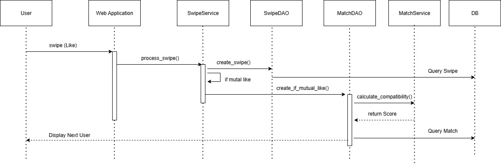

# App behavior
{: .no_toc }

  
Inhaltsverzeichnis

  {: .text-delta }
- TOC
{:toc}

---

## App Flow Diagram

Um den gesamten App Flow zu visualisieren, haben wir ein App Flow Diagram erstellt. Es zeigt die wichtigsten Screens und Übergänge zwischen ihnen.

---

[hier AppFlowDiagram]

---

## Swipe und Matching

Das folgende Sequenzdiagramm zeigt, wie ein Benutzer einen anderen liked und wie bei gegenseitigem Interesse automatisch ein Match erzeugt wird.

### Ablaufbeschreibung

1. **Swipe durch den Nutzer:**  
   Der Benutzer führt einen Swipe auf ein anderes Profil aus. Diese Aktion wird über die Web Application initiiert.

2. **Verarbeitung durch SwipeService:**  
   Die Web Application ruft die Methode `process_swipe()` im `SwipeService` auf. Dort wird zuerst der Swipe durch `create_swipe()` gespeichert.

3. **Prüfung auf gegenseitiges Interesse:**  
   Nach dem Speichern prüft der `SwipeService`, ob ein gegenseitiger "Like" vorliegt. Dies geschieht über `create_if_mutual_like()` im `MatchDAO`.

4. **Kompatibilitätsberechnung:**  
   Wird ein gegenseitiger Swipe erkannt, ruft `MatchDAO` den `MatchService` auf, um mit `calculate_compatibility()` die Übereinstimmung zwischen den beiden Persönlichkeitsprofilen zu berechnen.

5. **Match-Erstellung und Rückgabe:**  
   Nach erfolgreicher Berechnung wird ein `Match` erzeugt und gespeichert. Die Information wird über die Ebenen hinweg zurückgegeben.

6. **Anzeige des nächsten Nutzers:**  
   Unabhängig davon, ob ein Match entstanden ist, zeigt die App den nächsten verfügbaren Nutzer zum Swipen an.

### Sequenzdiagramm Matching

